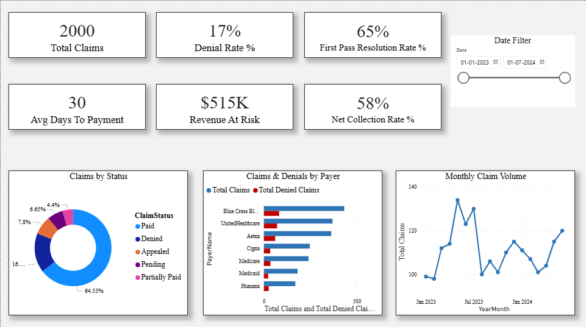
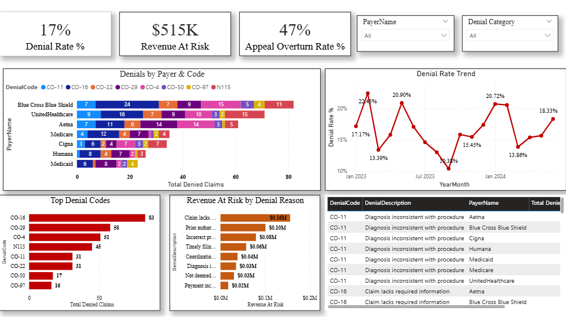
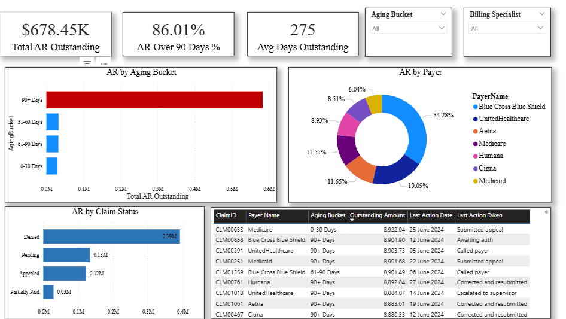
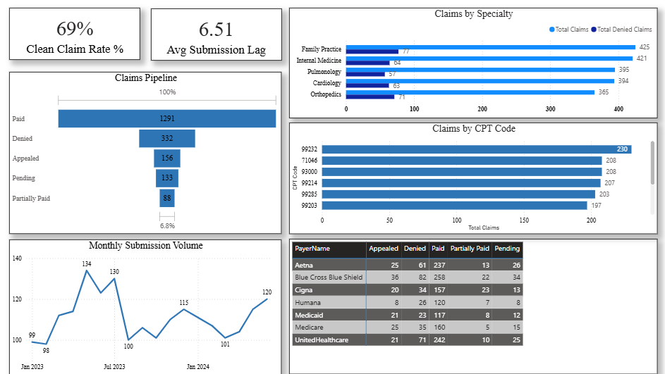
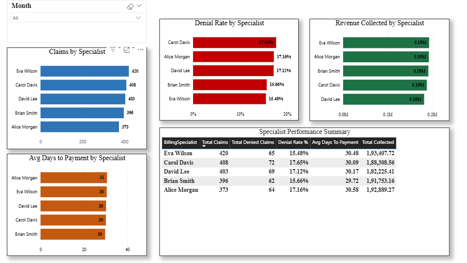

# 🏥 US Healthcare RCM Analytics Dashboard — Power BI

## 📊 Project Overview
A comprehensive Power BI analytics dashboard built to monitor and analyze US Healthcare Revenue Cycle Management (RCM) performance across claims, denials, AR aging, and team productivity.

**Dataset:** 2,000 synthetic claims records | Jan 2023 – Jun 2024
**Tool:** Power BI Desktop
**Domain:** US Healthcare — Revenue Cycle Management (RCM)

---

## 🎯 Business Problem
Healthcare providers lose millions annually due to claim denials, slow AR collection, and lack of real-time visibility into billing performance. This dashboard replicates real-world RCM analytics to help operations teams track KPIs and take corrective action faster.

---

## 📁 Dataset Tables
| Table | Rows | Description |
|-------|------|-------------|
| Claims_Data | 2,000 | Full claim lifecycle — status, amounts, denial codes |
| AR_Aging | ~700 | Outstanding claims with aging buckets |
| Date_Table | 548 | Calendar table for time intelligence |
| Payer_Ref | 7 | Payer reference data |

---

## 📈 Dashboard Pages
1. **Executive Overview** — KPI cards, claim status, payer breakdown
2. **Denial Management** — Denial rate, top codes, payer analysis, trends
3. **AR Aging** — Aging buckets, outstanding by payer, top stuck claims
4. **Claim Status Pipeline** — Funnel, submission trends, CPT analysis
5. **Team Performance** — Per-specialist denial rate, productivity, collections

---

## 🔑 Key KPIs Tracked
- Denial Rate % (Target: <15%)
- First Pass Resolution Rate % (Target: >65%)
- AR Over 90 Days % (Target: <25%)
- Avg Days to Payment (Target: <35 days)
- Net Collection Rate % (Target: >45%)
- Clean Claim Rate %

---

## 🛠️ DAX Measures Built
- Denial Rate %, First Pass Rate %, Clean Claim Rate %
- Revenue At Risk, Net Collection Rate %
- AR Over 90 Days %, Avg Days to Payment
- MoM Denial Rate change, YTD Claims, MTD Revenue

---

## 💡 Key Insights from the Data
- Overall Denial Rate: ~16.6% — above industry benchmark of <10%
- CO-16 (Missing Information) is the #1 denial reason — process gap at charge capture
- 90+ Days AR represents significant revenue risk — priority for follow-up
- Medicare shows fastest avg payment days; Medicaid slowest
- Carol Davis has highest denial rate (17.85%) — retraining recommended
- Blue Cross Blue Shield has highest claim volume and denial count

---

## 📸 Screenshots







---

## 🏗️ How to Use
1. Download `RCM_Dataset.xlsx`
2. Open Power BI Desktop
3. Get Data → Excel → Select all 4 sheets
4. Build relationships:
   - Claims_Data → Date_Table (DateOfService → Date)
   - Claims_Data → Payer_Ref (PayerName → PayerName)
   - AR_Aging → Claims_Data (ClaimID → ClaimID)
5. Mark Date_Table as Date Table
6. Create DAX measures in _Measures table
7. Build 5 dashboard pages

---

## 📂 Repository Structure
```
RCM-PowerBI-Dashboard/
├── README.md
├── RCM_Dataset.xlsx
├── US_Healthcare_RCM_Analytics_Dashboard.pbix
├── 01_Executive_Overview.png
├── 02_Denial_Management.png
├── 03_AR_Aging.png
├── 04_Claim_Status.png
└── 05_Team_Performance.png
```

---

## 👤 Author
**Kushank Kashyap** — Business Analyst | US Healthcare RCM | Power BI | SQL
[LinkedIn](https://linkedin.com/in/kushankkashyap) | [GitHub](https://github.com/Kushankkashyap)
